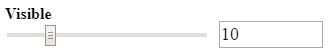

# Videx storybook input

User input modules for storybook.

- [GitHub Repository](https://github.com/equinor/videx-storybook-input)
- [Documentation](https://equinor.github.io/videx-storybook-input)

## Installation
```js
npm install --save @equinor/videx-storybook-input
```

## Usage

```js
// ES6
import { toggle, slider, ... } from '@equinor/videx-storybook-input';
```

## Modules

#### Slider



#### Toggle

Standard:


Hexagon:


## Available modules

<table style="width:auto;">
  <tr>
    <td><a href="https://equinor.github.io/videx-storybook-input/modules/_hexagontoggle_.html">hexagonToggle</a></td>
    <td><a href="https://equinor.github.io/videx-storybook-input/modules/_slider_.html">slider</a></td>
    <td><a href="https://equinor.github.io/videx-storybook-input/modules/_toggle_.html">toggle</a></td>
  </tr>
</table>

<br/>


